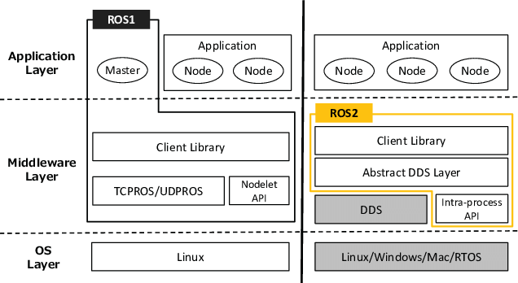

# Understanding the Basics
## ROS (Robot Operating System)
- A set of software libraries and tools for building robot applications
- It provides communication, control, and simulation tools for modular robot development

ROS2 is similar to ROS(1) but the big differences are that ROS2 is faster and based on DDS(Data Distribution Service).

## Node

- A small executable program that communitcate each other by publishing and subscribing
- Each node in ROS should be responsible for a single, modular purpose

## Topic

- The channel for sending data between nodes
- 1:N or N:N communication

## Parameter
- Configurable values that modify nodes’ behaviors

## Service

- Request - response structure (1:1)
- Good for short, deterministic tasks
- .srv file

## Action

- Request -> Feedback -> Result
- Used for long-running tasks
- .action file

## Interface
- Communication formats:
    - .msg, .srv, .action

## Launch
- Tool to run multiple nodes with configuration
- Written in Python 

## Composition
- Run multiple nodes inside a single process.
- Faster than using separate processes (launch).

## Executor
- Handle callbacks (subscriptions, timers, etc.)
    - Single-threaded: runs callbacks sequentially
    - Multi-threaded: runs callbacks in parallel

---

# Materials
- Ubuntu 22.04
- [Official ROS2 Humble Docs](https://docs.ros.org/en/humble/index.html)
- Yutube Videos
- Visual Studio (C++ / Python)
- Additional Tools
    - Turtlesim
    - Gazebo (Sim)
    - RViz 2