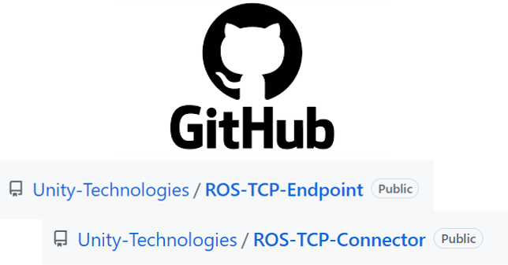
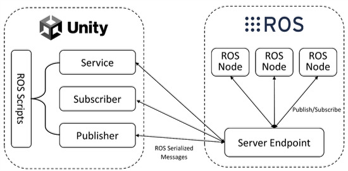
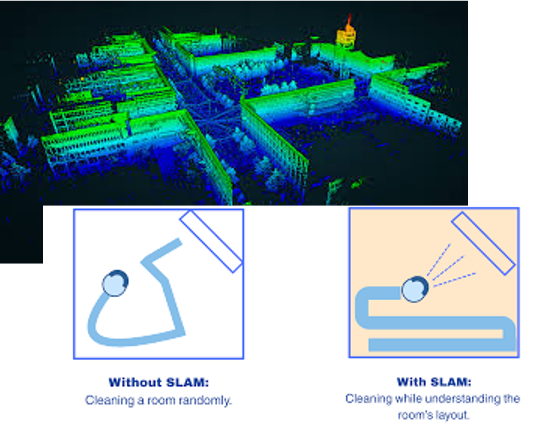

# Understanding the Basics
**ROS TCP Endpoint/Connector**

- Def: A ROS node that enables message passing over TCP between ROS2 and external systems like Unity
- Purpose: : Facilitates real-time communication for robotics simulations and visualizations
- Example: A ROS node sends robot position data to Unity, which renders the robot in a 3D environment

**ROS-Unity Communication**

> Image Source: [MDPI](https://www.mdpi.com/1424-8220/24/17/5680)
- Def: The broader process of how ROS 2 and Unity interact, using the TCP Endpoint/Connector to exchange data via topics, services, or actions.
- Example: Unity subscribes to a ROS topic (/robot_color) to change a robot’s color, or ROS responds to a Unity service request with a robot’s pose.

**SLAM (Simultaneous Localization & Mapping)**

> Image Source: [LASER_Scanning](https://www.laserscanning-europe.com/en/what-slam) and [KODIFLY](https://kodifly.com/what-is-slam-a-beginner-to-expert-guide)
- Def: A method for robots to build a map of an unknown environment while tracking their location within it.
- Applications: Autonomous navigation, 3D map reconstruction, obstacle avoidance.
- Example: A robot uses LIDAR to create a 2D occupancy grid in RViz, visualized in Unity.
