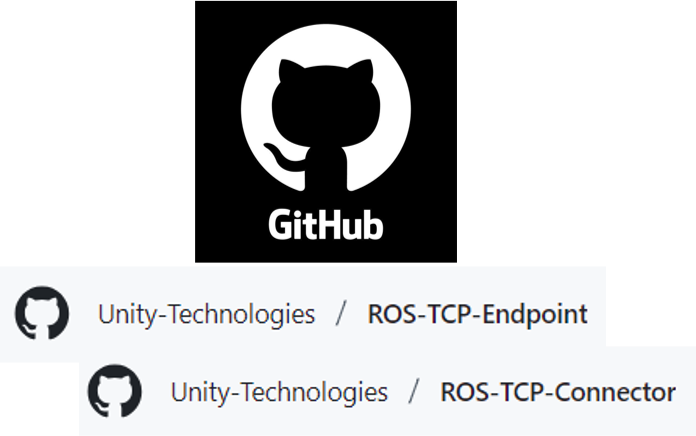
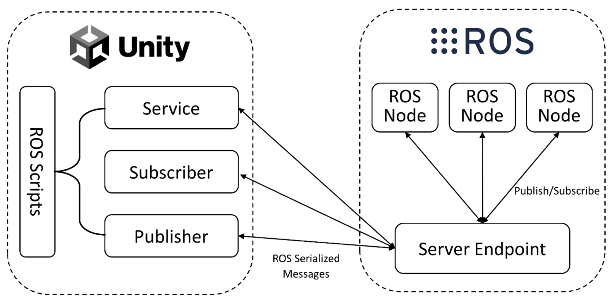
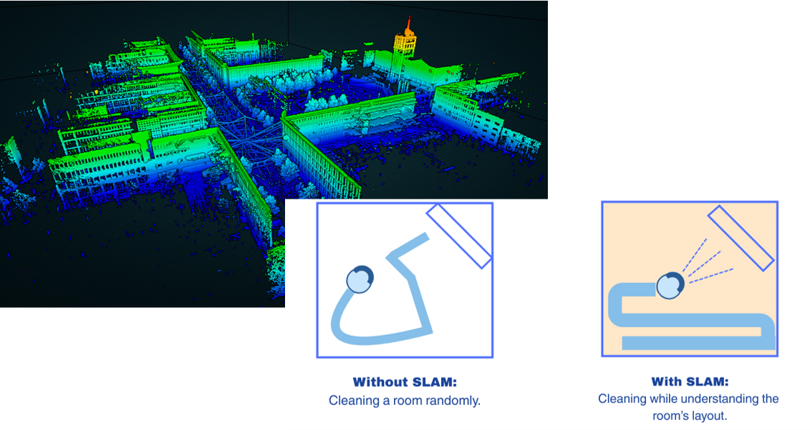
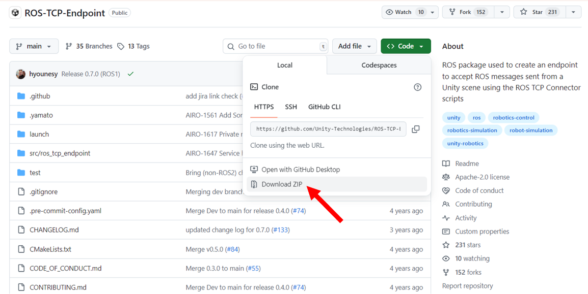
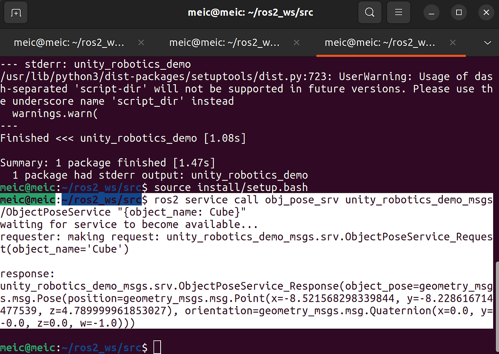

# Understanding the Basics
**ROS TCP Endpoint/Connector**

- **Def**: A ROS node that enables message passing over TCP between ROS2 and external systems like Unity
- **Purpose**: : Facilitates real-time communication for robotics simulations and visualizations
- **Example**: A ROS node sends robot position data to Unity, which renders the robot in a 3D environment

**ROS-Unity Communication**

> Image Source: [MDPI](https://www.mdpi.com/1424-8220/24/17/5680)
- **Def**: The broader process of how ROS 2 and Unity interact, using the TCP Endpoint/Connector to exchange data via topics, services, or actions.
- **Example**: Unity subscribes to a ROS topic (/robot_color) to change a robot’s color, or ROS responds to a Unity service request with a robot’s pose.

**SLAM (Simultaneous Localization & Mapping)**

> Image Source: [LASER_Scanning](https://www.laserscanning-europe.com/en/what-slam) and [KODIFLY](https://kodifly.com/what-is-slam-a-beginner-to-expert-guide)
- **Def**: A method for robots to build a map of an unknown environment while tracking their location within it.
- **Applications**: Autonomous navigation, 3D map reconstruction, obstacle avoidance.
- **Example**: A robot uses LIDAR to create a 2D occupancy grid in RViz, visualized in Unity.

---
# Materials
- Github
    > [ROS TCP Endpoint](https://github.com/Unity-Technologies/ROS-TCP-Endpoint?tab=readme-ov-file) 

    > [ROS TCP Connector](https://github.com/Unity-Technologies/ROS-TCP-Connector)
- ROS (I used Ubuntu 22.04 with ROS2 Humble)
- Unity v.2020.2+
- Visual Studio (for C#)
- RViz (for visualization in ROS)

---

# Tutorial
Since I used ROS2, this tutorial is written based on ROS2 (especially ROS2 Humble). 

## Setup
### ROS

1. Download [ROS TCP Endpoint](https://github.com/Unity-Technologies/ROS-TCP-Endpoint?tab=readme-ov-file)
2. In your src folder of ROS TCP Endpoint, navigate to your Colcon worspace and run the following commands:
```bash
source install/setup.bash
colcon build
source install/setup.bash
```
3. In your Colcon workspace, run the following command, replacing `<your IP address>` with your ROS machine's IP or hostname.
```bash
ros2 run ros_tcp_endpoint default_server_endpoint --ros-args -p ROS_IP:=192.168.0.5
```

- If you're running ROS in a Docker container, 0.0.0.0 is a valid incoming address, so you can write
  `ros2 run ros_tcp_endpoint default_server_endpoint --ros-args -p ROS_IP:=0.0.0.0`
- On Linux you can find out your IP address with the command `hostname -I`
- On MacOS you can find out your IP address with `ipconfig getifaddr en0`

---
Once the server_endpoint has started, it will print something similar to `[INFO] [1603488341.950794]: Starting server on 192.168.50.149:10000`.
(Alternative) If you need the server to listen on a port that's different from the default 10000, here's the command line to also set the ROS_TCP_PORT parameter:
```bash
ros2 run ros_tcp_endpoint default_server_endpoint --ros-args -p ROS_IP:=127.0.0.1 -p ROS_TCP_PORT:=10000
```

### Unity 
1. Open the Package Manager (`Window > Package Manager`)
2. Click the + button in the upper lefthand corner of the window. Select Add `package from git URL...`
3. Enter the git URL for the package. 
4. For the ROS-TCP-Connector, enter `https://github.com/Unity-Technologies/ROS-TCP-Connector.git?path=/com.unity.robotics.ros-tcp-connector`.
- (not necessary)For Visualizations, enter `https://github.com/Unity-Technologies/ROS-TCP-Connector.git?path=/com.unity.robotics.visualizations`.
5. Click `Add`.
6. open Robotics/ROS Settings from the Unity menu bar, and set the ROS IP Address variable to the IP you set earlier. (If you're using Docker, leave it as the default 127.0.0.1.)
7.  in the ROS Settings window, ROS2 users should switch the protocol to ROS2 now.

## ROS Unity Integration
### Publisher
<iframe width="100%" height="468" src="https://www.youtube.com/embed/oeHS8G2DeYs" title="Ball Interaction Video" frameborder="0" allow="accelerometer; autoplay; clipboard-write; encrypted-media; gyroscope; picture-in-picture; web-share" allowfullscreen></iframe>

> Unity publishes data (e.g., robot position coordinates) to a ROS 2 topic, which a ROS subscriber receives.

**Concept**: Unity can act as a Publisher, sending data continuously to a ROS topic.
**Typical Use Case**: Streaming an object’s position, velocity, or any sensor-like data from Unity to ROS.
**Unity Side**: You use the ROSConnection component to define the topic and message type, then call Publish() inside a Unity script.
**ROS Side**: A ROS node subscribes to the same topic to consume Unity’s data.

### Subscriber
<iframe width="100%" height="468" src="https://www.youtube.com/embed/TqKIByLq1NI" title="Ball Interaction Video" frameborder="0" allow="accelerometer; autoplay; clipboard-write; encrypted-media; gyroscope; picture-in-picture; web-share" allowfullscreen></iframe>

> ROS2 publishes a topic to change the color, and Unity subscribes to that topic to update it.

**Concept**: Unity can also subscribe to ROS topics and react when messages arrive.
**Typical Use Case**: ROS publishes sensor data or control commands, and Unity updates its simulation accordingly (e.g., changing color, triggering animations).
**Unity Side**: In Unity, you register a callback for a topic using Subscribe<T>().
**ROS Side**: A ROS node publishes messages to that topic.

### Service

> Unity (Service Client) request an object’s pose in Unity.
> ROS (Service Server) calculates its pose and responds to Unity.

**Concept**: Unlike Publishers/Subscribers, a Service works as a request–response pattern.
**Typical Use Case**: When Unity needs a precise answer at a specific moment.
**Unity as Service Client**: Unity sends a request, e.g., “What’s the pose of this object?”
**ROS as Service Server**: ROS computes the answer and returns it.

### Service Call
<iframe width="100%" height="468" src="https://www.youtube.com/embed/Jf0TovLSnvA" title="Ball Interaction Video" frameborder="0" allow="accelerometer; autoplay; clipboard-write; encrypted-media; gyroscope; picture-in-picture; web-share" allowfullscreen></iframe>
  1. Start at current position
  2. Move toward destination
  3. Near target → Request update from ROS
  4. Get new destination
  5. Repeat

**Concept**: A Service Call can be repeated in sequence to drive a process step by step.
**Typical Use Case**: Unity moves an object toward a goal. Once near the target, Unity requests a new goal from ROS, receives it, and continues.

> Note: While Publisher and Subscriber cover most real-time data flows, Services shine when you need precise, one-off information. The Service Call tutorial illustrates how even a simple request–response can orchestrate dynamic behavior when chained together.
> 
> In practice, you’ll often combine these: Publishers for streaming state, Subscribers for reacting to commands, and Services for exact queries. The key is to choose the right communication model for the task at hand.

## Robotics Nav2 SLAM Example
### Running 
- Clone the repo and launch the ROS 2 + SLAM system via launch_example.py

### Visualization
- DefaultVisualizationSuite
    - GoalPose [topic] for robot position
    - OccupancyGridVisualizer for SLAM map
    - LaserScanDefaultVisualizer for LIDAR


# Errors
## ROS Error
**Colcon Build**
- Wrong package name: ROS-TCP-Endpoint-main → ros_tcp_endpoint
- Wrong build location: colcon build inside Robotics-Nav2-SLAM-Example → Robotics-Nav2-SLAM-Example/ros2_docker/colcon_ws

**Not Connected to Unity**
- Wrong Wi-Fi
- Wrong ROS IP Address

## Unity Error
**`DeserializationException: Cannot deserialize message`**
- Rebuild msg files