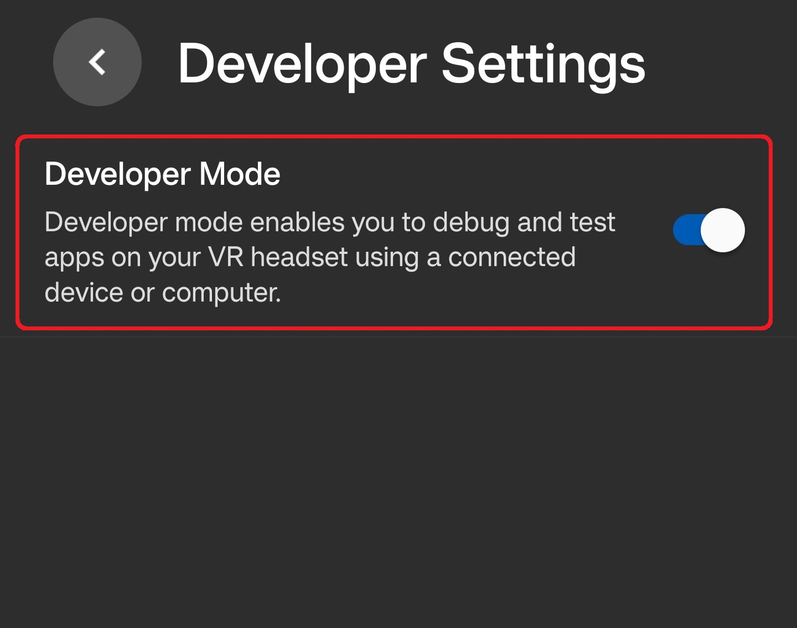
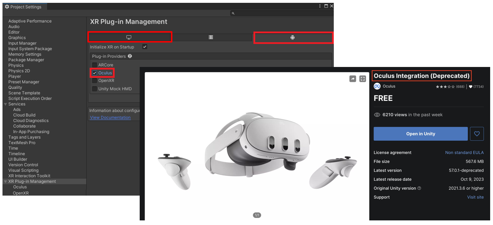

# Mixed Reality on Meta Quest 3

I've been diving into Mixed Reality (MR) recently, and I wanted to experiment with a simple Passthrough prototype on my Meta Quest 3. The goal was simple but oddly satisfying: see my real room through the headset, spawn virtual balls, and watch them bounce off walls and floors. Honestly, it felt a bit like playing catch with my own furniture. This post is my personal developer log — not a polished tutorial. I’ll walk through what I did, why I did it, what broke (and it did), and what I learned along the way.

# Tools
- Unity: v.2020.3.1f
- Meta Quest 3
- USB-C Cable (for building)
- [Oculus Integration Package from Unity Asset Store](https://assetstore.unity.com/packages/tools/integration/oculus-integration-deprecated-82022?srsltid=AfmBOoqs3VykViopb9qVxMb3gFcYp88tIxOFRBEoxyUs_zHPXRYparKT)

💡 *Focus:* Passthrough and OVRManager behaves slightly differently depending on Unity version. Specifying this ensures anyone trying to replicate my steps hits the same quirks I did.

# Understanding the Basics
Before jumping into Unity, I clarified the essential concepts:

- **Mixed Reality (MR):** blends virtual content with the real world.
- **Extended Reality (XR):** umbrella term for VR, AR, and MR.
- **Passthrough:** lets you see the real world through the Quest's cameras, layered with virtual objects.

💡 *Tip:* MR is not just "turn on a camera." Understanding this early saves time when configuring cameras, layers, and interactions in Unity.

# Step-by-Step Tutorials
## Setup
### 1. Enable Developer Mode

- Create a **Meta Developer Account** in [Meta Developers](https://developers.meta.com/horizon/sign-up/).
- Turn on **Developer Mode** in the Meta Horizon app.

💡 *Why:* Unity builds won’t run without this — basically telling the headset “I’m making stuff, not just playing games.”

### 2. Setting Up Unity for Oculus Development

- Go to **Edit → Project Settings → XR Plug-in Management**, enable **Oculus** for both Windows and Android.
- Install [**Oculus Integration**](https://assetstore.unity.com/packages/tools/integration/oculus-integration-deprecated-82022?srsltid=AfmBOoqs3VykViopb9qVxMb3gFcYp88tIxOFRBEoxyUs_zHPXRYparKT) from the Unity Asset Store.
- Run **Tools → Project Setup Tool → Fix All & Apply All** (this actually fixed more problems than I expected).
- Switch platform in **File → Build Settings → Android**.

💡 *Why:* Quest 3 runs Android. Without XR plugin + Oculus package, Unity cannot communicate with the headset. I learned this the hard way when my first build just showed a black screen.

### 3. Connecting the Headset

- **AirLink (Wireless):** convenient but slightly blurry visuals and slower builds.  
- **USB-C (Wired):** stable, faster builds — my go-to.

💡 *Why:* Fast iteration is key. Waiting 10 minutes per build kills momentum; 2 minutes keeps you in the flow.

## Passthrough Setup

### 4. Camera Configuration

<!--  -->

- Delete the default **Main Camera**.
- Add **OVRCameraRig** prefab to the scene.
- Configure **OVRManager**:
  - Hand Tracking → "Controllers and Hands"
  - Passthrough Support → "Supported"
  - Enable Passthrough → Checked

💡 *Why:* OVRCameraRig handles VR rendering, tracking, and input. Passthrough won’t work without enabling it.

### 5. Adding Passthrough Layer

- Create an empty GameObject named `Passthrough`.
- Add **OVR Passthrough Layer** component.
- Placement → "Underlay".
- Set `CenterEyeAnchor` Clear Flags → Solid Color, background → Black.

💡 *Why:* Underlay ensures the real world sits behind virtual objects. Overlay mode caused weird blending when I first tried it.

## Scene Scanning

### 6. Scanning Real Space

<!--  -->

- Add **OVRSceneManager** to the scene.
- Assign **Plane** and **Volume** prefabs for surface detection.

💡 *Why:* Passthrough shows the room, but virtual balls would pass through walls if there’s no mesh. Scene scanning creates a mesh for objects to collide with.

## Ball Interaction

### 7. Spawn Script & Physics

<!--  -->

- Attach `SpawnBall` script to **RightHandAnchor**.
- Create **Physic Material** `Bounce` (Bounciness = 1).
- Create a small sphere (scale 0.1), add Rigidbody + Bounce material.
- Link sphere prefab to the spawn script.

💡 *Why:* This turns Passthrough from “nice visual” into something interactive. Watching the ball bounce off my desk for the first time was oddly satisfying.

# Lessons Learned

## What Broke

- AirLink → blurry visuals, slow loads.  
- USB builds → still ~10 minutes sometimes.  
- Unity sometimes failed to detect Quest if Wi-Fi was misconfigured.

💡 *Tip:* Check networking first — saves hours of frustration.

## Lessons & Extensions

- **Interactive Navigation Cues:** Seeing balls collide with walls made me realize the same logic could overlay arrows indoors.  
- **Spatial Data Visualization:** Accurate mesh alignment is key — could extend to real-time safety or maintenance overlays.  
- **Room-Aware Game Mechanics:** Physics against real walls suggests gameplay mechanics using your room as a level.  
- **Furniture/Object Placement:** Adjusting spawn positions to avoid clipping revealed potential to preview items realistically.

💡 *Takeaway:* These are not just wishlist ideas. They come directly from the problems I solved while setting up Passthrough, physics, and mesh scanning. Plus, seeing the first perfect bounce felt amazing.

