# Mixed Reality on Meta Quest 3

I've been diving into Mixed Reality (MR) recently, and I wanted to experiment with a simple Passthrough prototype on my Meta Quest 3. The goal was simple but oddly satisfying: see my real room through the headset, spawn virtual balls, and watch them bounce off walls and floors. Honestly, it felt a bit like playing catch with my own furniture. This post is my personal developer log — not a polished tutorial. I’ll walk through what I did, why I did it, what broke (and it did), and what I learned along the way.

# Understanding the Basics
Before jumping into Unity, I clarified the essential concepts.
- **Mixed Reality (MR)**: blends virtual content with the real world.
- **Extended Reality (XR)**: umbrella term for VR, AR, and MR.
- **Passthrough**: lets you see the real world through the Quest's cameras, layered with virtual objects.

💡*Why this matters*: MR is not just "turn on a camera." Understanding this early saves time when configuring cameras, layers, and interactions in Unity.

# Tools
- Unity: v.2020.3+
- Meta Quest 3
- USB-c Cable (for Building)
- [Oculus Integration](https://assetstore.unity.com/packages/tools/integration/oculus-integration-deprecated-82022?srsltid=AfmBOoqs3VykViopb9qVxMb3gFcYp88tIxOFRBEoxyUs_zHPXRYparKT) Package from Unity Asset Store

I used 2020.3.1f Unity version. Passthrough and OVRManager behaves slightly differently depending on Unity version. Specifying this ensures anyone trying to replicate my steps hits the same quirks and solutions I did.

---

# Step-by-Step Tutorials
## Setup
### 1. Enable Developer Mode

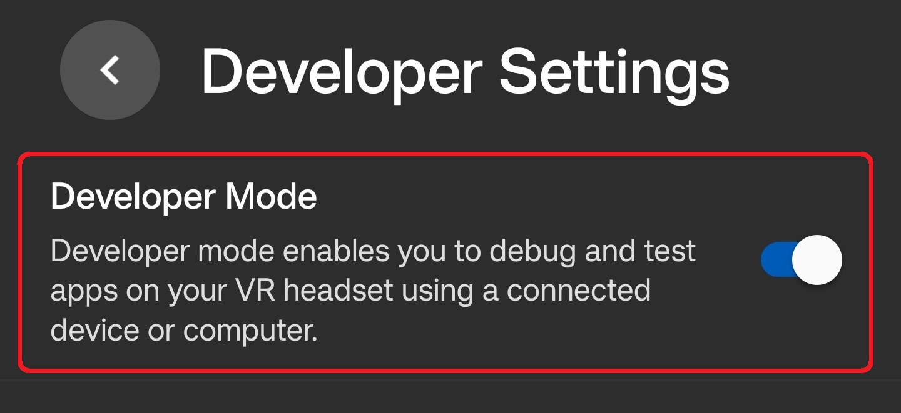

- Create a **Meta Developer Account** in [Meta](https://developers.meta.com/horizon/sign-up/).
- Turn on **Developer Mode** in the Meta Horizon app


### 2. Setting Up Unity for Oculus Development

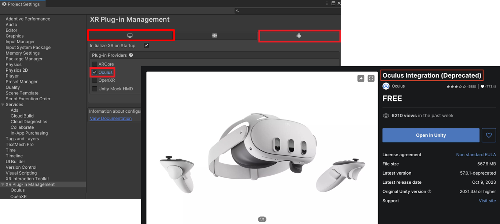

- Go to `Edit → Project Settings → XR Plug-in Management`, enable **Oculus** for both Windows and Android.
- Install [**Oculus Integration**](https://assetstore.unity.com/packages/tools/integration/oculus-integration-deprecated-82022?srsltid=AfmBOoqs3VykViopb9qVxMb3gFcYp88tIxOFRBEoxyUs_zHPXRYparKT) from the Unity Asset Store.
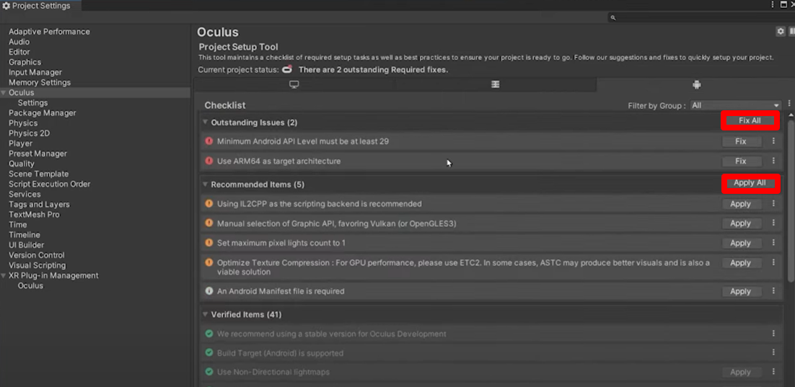
-  Run `Tools → Project Setup Tool → Fix All & Apply All` (this actually fixed more problems than I expected).
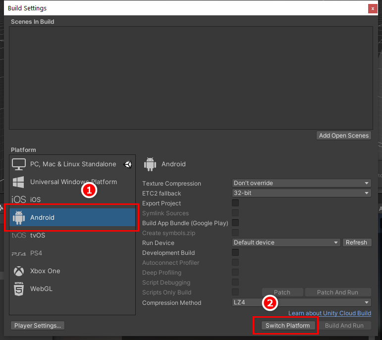
- **Switch platform** in `File → Build Settings → Android`.

💡 Why:
Quest 3 runs Android. Without the XR plugin + Oculus package, Unity can’t talk to the headset — I learned this the hard way when nothing showed up in my first test build.

---

## Connecting the Headset & Building
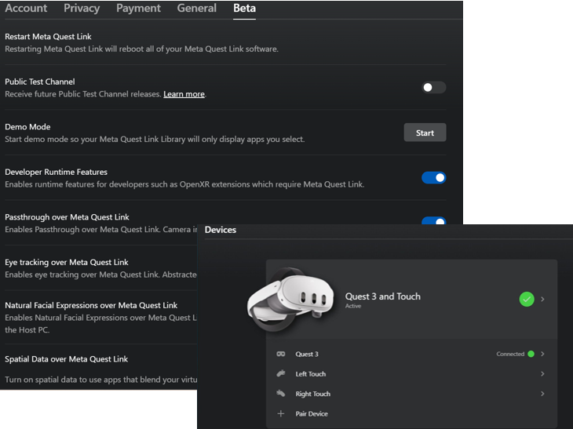
### Method 1: **AirLink (Wireless)**
convenient, but slightly blurry visuals and longer builds — kind of frustrating when you’re in the zone

- Turn on Developer settings in Quest (Settings → Beta)
- Connect Quest to PC via AirLink
- Run from Unity. (May cause longer load times)

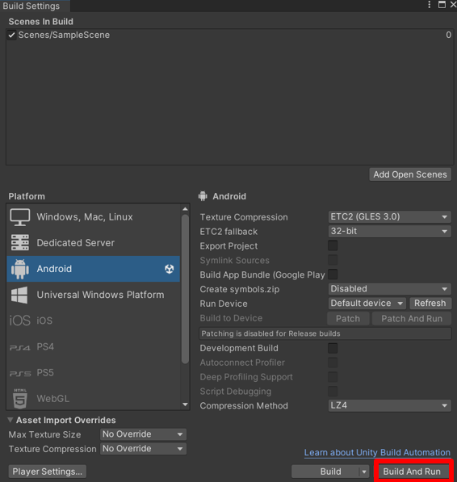
### Method 2 (Recommended): **USB-C (Wired)** 
more stable, faster builds

- Connect Quest via USB-C cable
- In Unity, go to `files → build settings` and click **Build and Run**.

---

## Passthrough
### 1. Camera Configuration
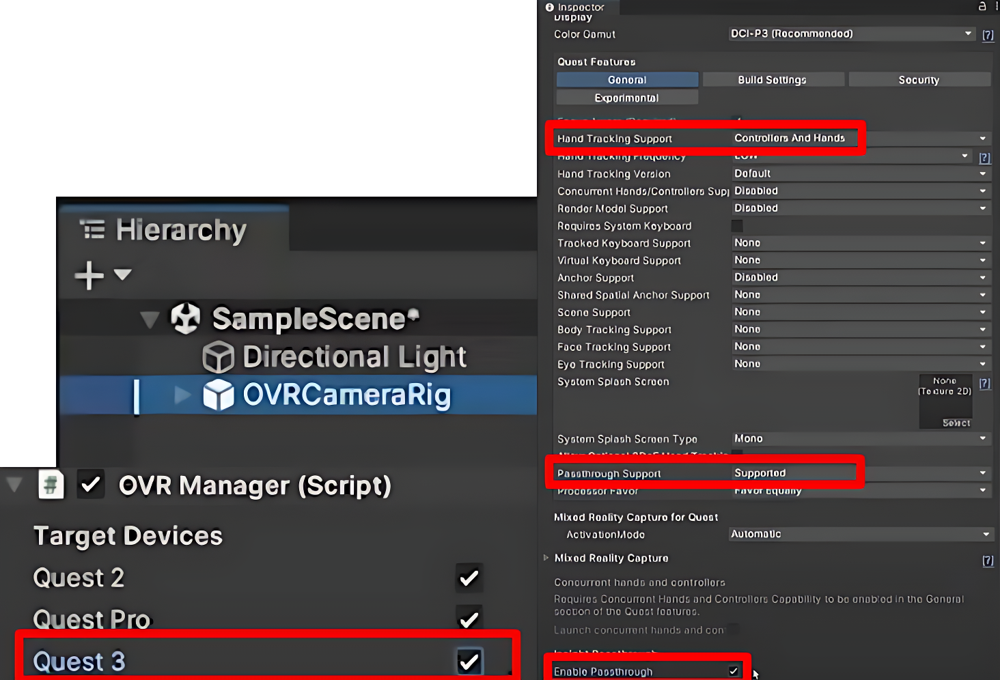
- Delete the default `Main Camera`.
- Add `OVRCameraRig` prefab.
- In `OVRManager` (inside OVRCameraRig), set:
    - Hand Tracking Support → “Controllers and Hands”
    - Passthrough Support → “Supported”
    - Enable Passthrough → Checked

- Add `OVRControllerPrefab` and `OVRHandPrefab` to Right/LeftHandAnchor.
- For `RightHandPrefab`, change to **hand right** in components: **OVR Hand**, **OVR Skeleton** and **OVR Mesh comp**.

💡 Why:
The default `Main Camera` does not support VR tracking or Passthrough. So we have to replce the deafault `Main Camera` into `OVRCameraRig` which handels stero rendering, tracking, and device input. Changing settings in `OVRManager` enables both controllers and hands in MR while turing on Passthrough. `OVRControllerPrefab` and `OVRHandPrefab` provide controller/hand models so you can actually see and interact with them in MR.

### 2. Adding the Passthrough Layer
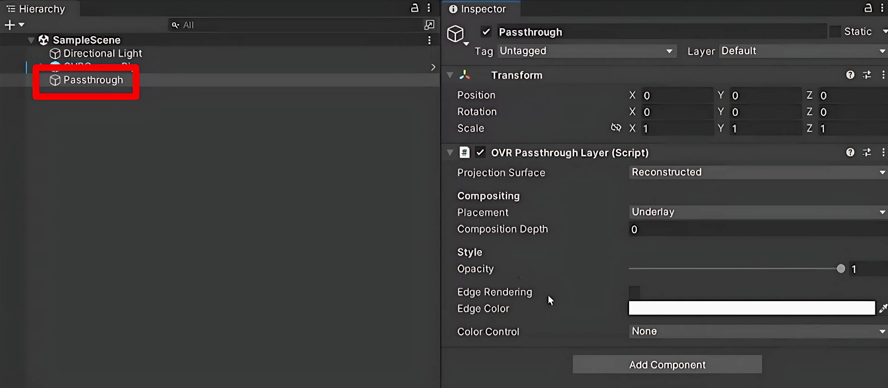
- Create an empty object `Passthrough`.
- Reset its Transform.
- Add **OVR Passthrough Layer** component inside Passthrough.
- Change **Placement → Underlay**.

💡 Why:
Underlay makes the real-world view sit behind virtual objects, avoiding weird overlaps.


- In `CenterEyeAnchor`, set Clear Flags to **Solid Color** and backaground to **black**.
- Create 3D object `Cube` in Hierarchy and adjust the position as needed.

💡 Why:
Prevents Unity’s default skybox or other background from showing through. A quick test object to confirm Passthrough + rendering are working.


## Video
<iframe width="100%" height="468" src="https://www.youtube.com/embed/DnNl0YZpAPk" title="Passthrough Video" frameborder="0" allow="accelerometer; autoplay; clipboard-write; encrypted-media; gyroscope; picture-in-picture; web-share" allowfullscreen></iframe>

---

## Scan Space
### 1.OVR Settings

- Add `OVRSceneManager`.
    1. Assign **Plane (OVR Scene Anchor)** to *Plane Prefab* and **Volume (OVR Scene Anchor)** to *Volume Prefab* (plane mesh & volume).
    2. Assign **Invisible Plane (OVR Scene Anchor)** to *Plane Prefab* and **Invisible Volume (OVR Scene Anchor)** to *Volume Prefab* (plane mesh & volume). — *recommended*.

- In `OVRCameraRig`, change to **Supported** in scene support.

💡 Why: 
Plane and Volume in `OVRSceneManager` enables scene understanding so your virtual objects can collide with real-world walls/floors. Invisible prefabs keep the real-world mesh hidden but functional. Without enabling scene support in `OVRCameraRig`, the headset won’t actually run scene scanning.

## Video
<iframe width="100%" height="468" src="https://www.youtube.com/embed/sJj2BqZMWRE" title="Scan Space Video" frameborder="0" allow="accelerometer; autoplay; clipboard-write; encrypted-media; gyroscope; picture-in-picture; web-share" allowfullscreen></iframe>

---

## Ball Interaction
### 1. Ball Interaction Script
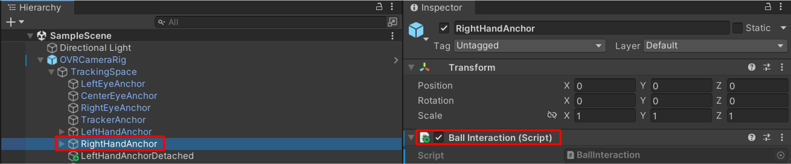
- Go `RightHandAnchor → Add Component` and create a **BallInteraction** component.
- Copy and paste the below script.
````BallInteraction
```csharp
using System.Collections;
using System.Collections.Generic;
using UnityEngine;

public class BallInteraction : MonoBehaviour
{
    public GameObject prefab;
    public float spawnSpeed = 5;

    void Update()
    {
        if (OVRInput.GetDown(OVRInput.Button.SecondaryHandTrigger))
        {
            GameObject Ball = Instantiate(prefab, transform.position, Quaternion.identity);
            Rigidbody BallRB = Ball.GetComponent<Rigidbody>();
            BallRB.velocity = transform.forward * spawnSpeed;
        }
    }
}
```
💡 Why: 
This script lets you spawn and throw balls from your right hand trigger.

### 2. Physics
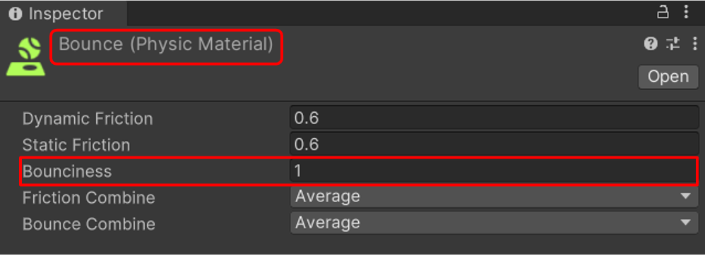
- Create a Physic Material `Bounce` (Bounciness=1) in Assets folder.
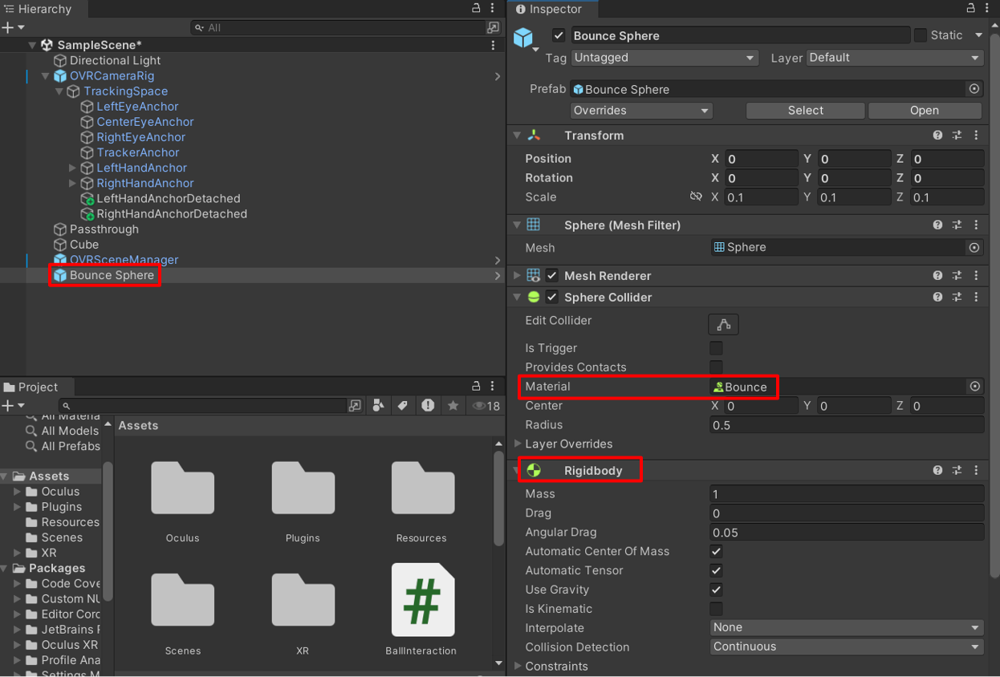
- Create a 3D object sphere `Bounce Sphere` (scale 0.1, 0.1, 0.1) and add **Rigidbody**.
- Go `Bounce Sphere → Sphere Collider → Material` and assign `Bounce`.
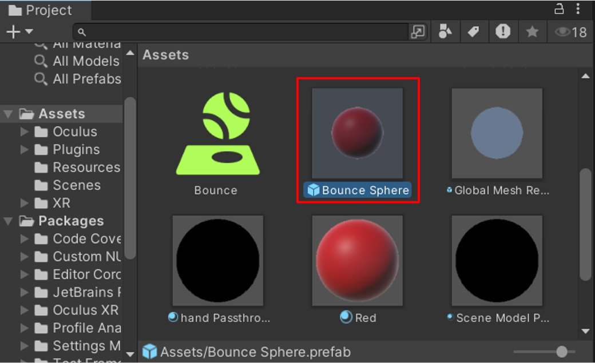
- Add `Bounce Sphere` in Asset folder and remove it in Sample Scene.
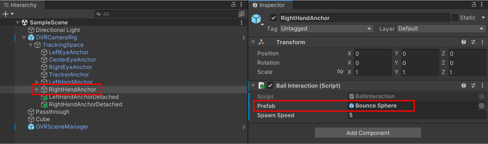
- Go `RightHandAnchor → Ball Interaction → Prefab` and assign `Bounce Sphere`.

💡 Why: 
The Rigidbody and Physics Material make the ball actually bounce instead of rolling lifelessly, and saving it as a prefab keeps spawning clean and reusable.

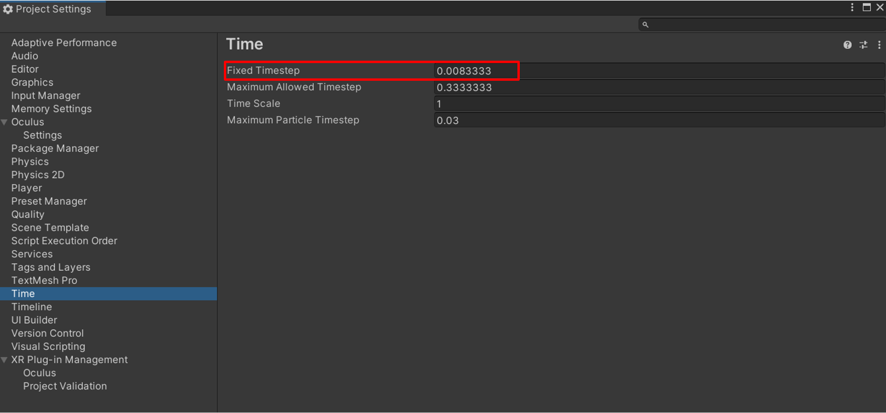
- Go `Edit → Project Settings → Time` and set **Fixed TImeStep = 0.0083333**.


💡 Why: 
Matching Unity’s physics update to 90 Hz reduces jitter in MR, and linking the prefab ensures that pressing the trigger spawns bouncy balls.

## Video
<iframe width="100%" height="468" src="https://www.youtube.com/embed/-LsH-tnGQBY" title="Ball Interaction Video" frameborder="0" allow="accelerometer; autoplay; clipboard-write; encrypted-media; gyroscope; picture-in-picture; web-share" allowfullscreen></iframe>

---

# Errors
- AirLink → blurry visuals, slower loads.
- USB builds → load more than 10 mins sometimes.
- Unity sometimes didn’t detect Quest if Wi-Fi was off or connected to different Wi-Fi with your computer.

---

# Future Usage
- **Interactive Navigation Cues**: Seeing balls collide with scanned walls made me think: if objects can interact reliably with meshes, you could use the same logic to overlay arrows indoors.

- **Spatial Data Visualization**: Aligning balls with real surfaces highlighted the importance of accurate mesh placement. This directly extends to real-time overlays on equipment.

- **Room-Aware Game Mechanics**: Physics interactions with walls suggest gameplay mechanics: your real room can become the level itself.

- **Furniture / Object Placement**: Adjusting spawn positions to avoid clipping with walls/furniture revealed the potential to preview objects realistically in your own space.

---