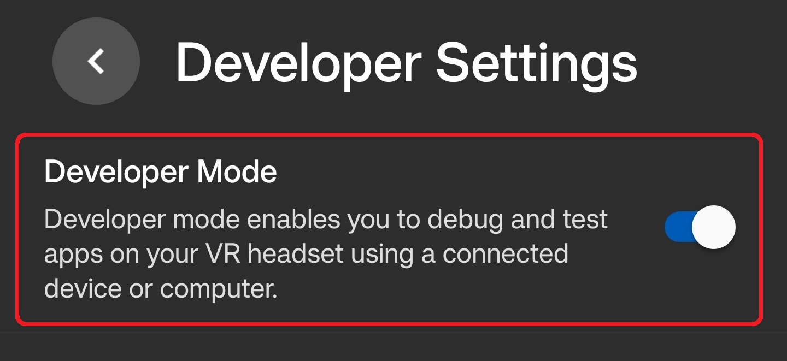
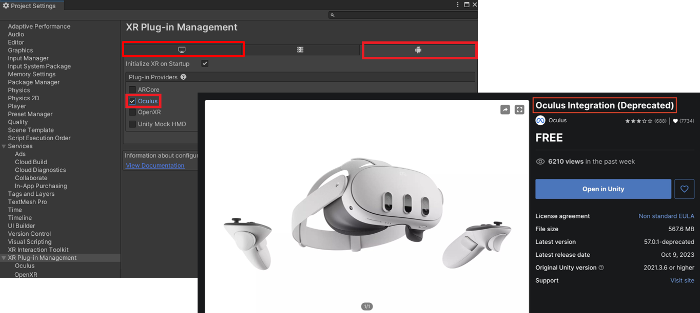

# Mixed Reality on Meta Quest 3

I've been diving into Mixed Reality (MR) recently, and I wanted to experiment with a simple Passthrough prototype on my Meta Quest 3. The goal was simple but oddly satisfying: see my real room through the headset, spawn virtual balls, and watch them bounce off walls and floors. Honestly, it felt a bit like playing catch with my own furniture. This post is my personal developer log — not a polished tutorial. I’ll walk through what I did, why I did it, what broke (and it did), and what I learned along the way.

# Tools
- Unity: v.2020.3+
- Meta Quest 3
- USB-c Cable (for Building)
- [Oculus Integration Package from Unity Asset Store](https://assetstore.unity.com/packages/tools/integration/oculus-integration-deprecated-82022?srsltid=AfmBOoqs3VykViopb9qVxMb3gFcYp88tIxOFRBEoxyUs_zHPXRYparKT)

I used 2020.3.1f Unity version. Passthrough and OVRManager behaves slightly differently depending on Unity version. Specifying this ensures anyone trying to replicate my steps hits the same quirks and solutions I did.

# Understanding the Basics
Before jumping into Unity, I clarified the essential concepts.
- **Mixed Reality (MR)**: blends virtual content with the real world.
- **Extended Reality (XR)**: umbrella term for VR, AR, and MR.
- **Passthrough**: lets you see the real world through the Quest's cameras, layered with virtual objects.

💡Focus: MR is not just "turn on a camera." Understanding this early saves time when configuring cameras, layers, and interactions in Unity.

# Step-by-Step Tutorials
## Setup
### 1. Enable Developer Mode

- Create a **Meta Developer Account** in [Meta](https://developers.meta.com/horizon/sign-up/).
- Turn on **Developer Mode** in the Meta Horizon app

### 2. Setting Up Unity for Oculus Development

- Go to `Edit → Project Settings → XR Plug-in Management`, enable **Oculus** for both Windows and Android.
- Install [**Oculus Integration**](https://assetstore.unity.com/packages/tools/integration/oculus-integration-deprecated-82022?srsltid=AfmBOoqs3VykViopb9qVxMb3gFcYp88tIxOFRBEoxyUs_zHPXRYparKT) from the Unity Asset Store.
<!--  -->
-  Run `Tools → Project Setup Tool → Fix All & Apply All` (this actually fixed more problems than I expected).
<!--  -->
- **Switch platform** in `File → Build Settings → Android`.

💡 Why:
Quest 3 runs Android. Without the XR plugin + Oculus package, Unity can’t talk to the headset — I learned this the hard way when nothing showed up in my first test build.

## Connecting the Headset & Building
### Method 1: **AirLink (Wireless)**
convenient, but slightly blurry visuals and longer builds — kind of frustrating when you’re in the zone

- Turn on Developer settings in Quest (Settings → Beta)
- Connect Quest to PC via AirLink
- Run from Unity. (May cause longer load times)

### Method 2 (Recommended): **USB-C (Wired)** 
more stable, faster builds

- Connect Quest via USB-C cable
- In Unity, go to `files -> build settings` and click **Build and Run**.

## Passthrough
### 1. Camera Configuration
- Delete the default **Main Camera**.
- Add **OVRCameraRig** prefab.
- In **OVRManager** (inside OVRCameraRig), set:
    - Hand Tracking Support → “Controllers and Hands”
    - Passthrough Support → “Supported”
    - Enable Passthrough → Checked
- Add **OVRControllerPrefab** and **OVRHandPrefab** to Right/LeftHandAnchor.
- For RightHandPrefab, change to **hand right** in OVR Hand & OVR Skeleton & OVR Mesh.

💡 Why:
OVRCamera is a script that controls stereo rendering and head tracking. It replaces the standard Unity camera.

### 2. Adding the Passthrough Layer
- Create an empty object **Passthrough**.
- Reset its Transform.
- Add **OVR Passthrough Layer** component inside Passthrough.
- Change **Placement → Underlay**.

## 3. Other Settings
- In CenterEyeAnchor, set Clear Flags to **Solid Color** and backaground to **black**.
- Create 3D object **cube** in Hierarchy and adjust the position as needed.

## Scan Space
### 1.OVR Settings
- Add OVRSceneManager.
    1. Assign **Plane (OVR Scene Anchor)** to *Plane Prefab* and **Volume (OVR Scene Anchor)** to *Volume Prefab* (plane mesh & volume).
    2. Assign **Invisible Plane** to both *Plane Prefab* and *Volume Prefab* (no visible mesh & volume) — *recommended*.
- In OVRCameraRig, 
