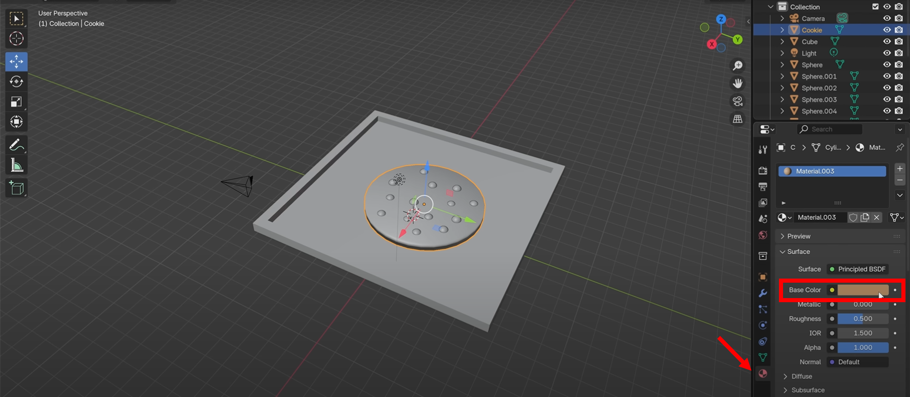
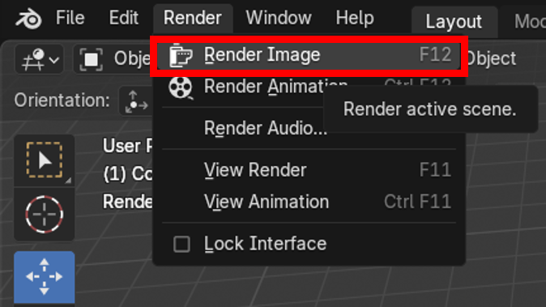

# My Blender Tutorial Experience
I recently dove into 3D modeling with **Blender**, a free yet insanely powerful tool. My goal? Prepare for future **Unity** projects and finally get comfortable creating things from scratch in 3D. To kick things off, I followed two YouTube tutorials:
- [Blender Beginner Tutorial](https://www.youtube.com/watch?v=Ci3Has4L5W4)  
- [Blender Floor Plan Tutorial](https://www.youtube.com/watch?v=94kAIpRnhcY)  

---

# Understanding the Basics
Before starting, I clarified essential 3D modeling concepts.  

| Term       | Description |
| ---------- | ----------- |
| `Mesh`     | A combination of vertices (points), edges (lines), faces (polygons), or any combination of these. |
| `Geometry` | Any 3D object with position data, including meshes, curves, instances, volumes, etc. |
| `Instance` | A duplicate of an object sharing the same underlying data as the original. |
| `Shader`   | A program controlling how light interacts with a surface, affecting color, reflection, transparency, and emission. In Blender, it’s often used interchangeably with `material`. |

💡 *Why it matters*: Blender can feel like a maze at first. Understanding meshes, modifiers, and basic geometry gave me a clear roadmap—I suddenly knew what to click, move, and tweak.

---

# Tools & Resources
- **Blender**: [Download v4.4](https://www.blender.org/download/releases/4-4/)  
- YouTube Tutorials:  
    - [Beginner Tutorial](https://www.youtube.com/watch?v=Ci3Has4L5W4)  
    - [Floor Plan Tutorial](https://www.youtube.com/watch?v=94kAIpRnhcY)  

---

# Essential Shortcuts
| Shortcut | Action |
| -------- | ------ |
| `Middle Mouse` | Orbit around scene |
| `Shift + Middle Mouse` | Pan view |
| `Mouse Wheel Scroll` | Zoom in/out |
| `Tab` | Switch between Object/Edit Mode |
| `N` | Toggle Sidebar |

For **Object Mode**:
| Shortcut | Action |
| -------- | ------ |
| `T` | Toggle Toolbar |
| `G` | Move objects |
| `R` | Rotate objects |
| `S` | Scale (resize) objects |
| `Shift + A` | Add object |
| `Alt` (when adding) | Add object in perfect form (e.g., perfect cube or triangle) |
| `Ctrl + L` | Link properties between objects |

💡 *Tip:* For more shortcuts, check Blender’s [Keymap Documentation](https://docs.blender.org/manual/en/latest/interface/keymap/introduction.html).

---

# Step-by-Step Experience

## Tutorial 1: [Blender Beginner Tutorial](https://www.youtube.com/watch?v=Ci3Has4L5W4)
This tutorial covered the fundamentals:  
- Navigating Blender’s viewport  
- Differences between **Edit Mode** and **Object Mode**  
- Building a simple object step by step  

### Recommended Setup
- Go to `Edit > Preferences > Interface` and adjust the **Resolution Scale**  
💡 *Why:* Makes Blender easier to work with depending on your screen size.  

- Check your GPU under `System > Cycles Render Devices > CUDA`  
💡 *Why:* Ensures hardware acceleration for faster rendering.  

- Increase **Undo Steps** to **100** in `System > Memory & Limits`  
💡 *Why:* Allows more flexibility when correcting mistakes.  

---

### Making a Cookie

#### 1. Cookie Base

- Add a **Cylinder** (`Shift + A > Mesh > Cylinder`).
- Scale (`S`) to flatten into a cookie shape.
- Right-click → `Shade Smooth` for a softer look.

- Rename it Cookie in the Outliner to stay organized.

#### 2. Chocolate Chips

- Add a **UV Sphere** (`Shift + A > Mesh > UV Sphere`)  
- Scale down (`S`) to chip size  
- Position using **Move** (`G`)  

- Duplicate chips (`Shift + D`) and place around the cookie  

#### 3. Tray
- Add a **Cube** (`Shift + A > Mesh > Cube`)  
- Scale and move to sit under cookie
1[insetFace](./images/5Blender1-5.png)
- Enter **Edit Mode** (`Tab`), select top face, use **Inset Faces** (`I`)  

- Extrude inner face down (`E`) to create tray depth

- Move the tray under the cookie.

#### 4. Materials & Colors

- Add material in **Material Properties** → `New`  
- Choose **Base Color** for cookie, chips, and tray  

- To quickly assign the same material, select chips → last chip with material → `Ctrl + L > Materials`  

#### 5. Lighting & Rendering

- Click **Viewport Shading: Rendered**
- Delete default light → Add **Area Light** (`Shift + A > Light > Area`)  

- Position camera (`0` on numpad, enable **Camera to View**)  
- Set render engine to **Cycles** for realism  

- Render with `F12` → Save via `Image > Save As`  

---

## Tutorial 2: [Blender Floor Plan Tutorial](https://www.youtube.com/watch?v=94kAIpRnhcY)
This tutorial focused on combining objects and creating a full scene:  
- Importing and scaling floor plan images  
- Modeling floors and walls  
- Applying materials, lighting, and render settings  

#### 1. Setup
- Download a floor plan image  
- Open Blender, select all (`A`) and delete (`X`) default objects  
- Import image → Creates an Empty object  
- Reset location & rotation: `Alt + G`, `Alt + R`  
- Switch to Top Orthographic View (`7` on numpad)  
- Set **Units** to Metric (Scene Properties → Units → Metric → Meters)  

#### 2. Floor & Walls
- Add **Plane** → Rename to **Floor**  
- Set dimensions in Item Sidebar → Apply scale (`Ctrl + A > Scale`)  
- In **Edit Mode**, delete face (`X > Only Faces`)  
- Extrude vertices (`E`) along X/Y to match outer walls  
- Extrude inner walls for rooms  

#### 3. Finalizing & Rendering
- Duplicate floor → rename **Background**, delete faces, extrude outline  
- Hide Floor/Background, select Walls → Extrude upwards along Z-axis (`E`)  
- Add **Solidify Modifier** (Complex mode, adjust thickness)  
- Check **Face Orientation** (Blue = correct, Red = flipped) → Fix flipped faces (`Shift + N`)  
- Save your work (`Ctrl + S`)  

---

# Summary
At the end of the day, it wasn’t just about a cookie or a floor plan. These tutorials taught me how to bring any idea to life in 3D. Modeling, texturing, lighting—once you get the hang of these, you’re ready for bigger projects, whether it’s games, architectural visualization, or AR. Honestly, seeing something I imagined appear on screen made me even more excited to dive into Unity. In 3D, the only limit really is your imagination.

💡 *Final Tip:* Always organize objects, name them clearly, and save iterations frequently. This keeps projects manageable as scenes get complex.

---